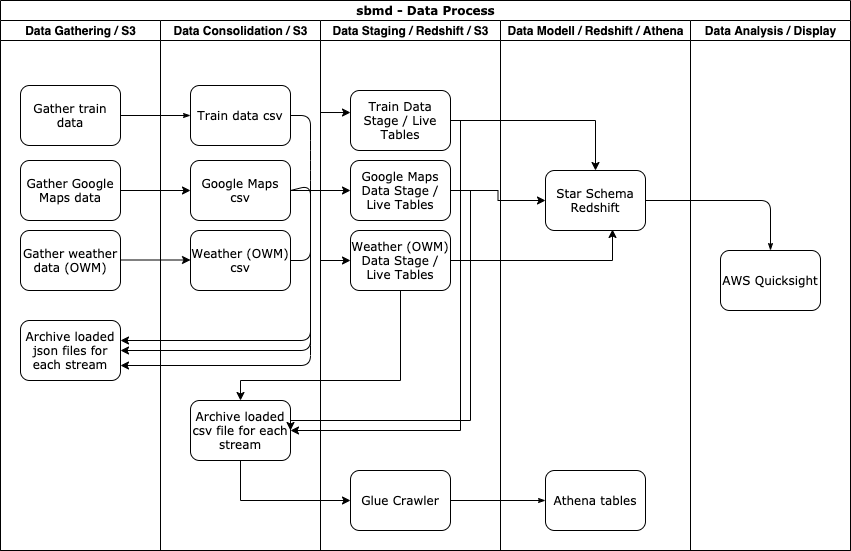
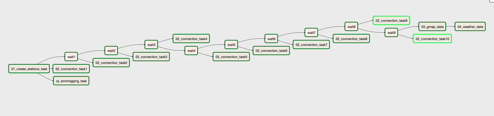
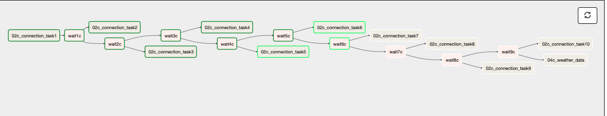
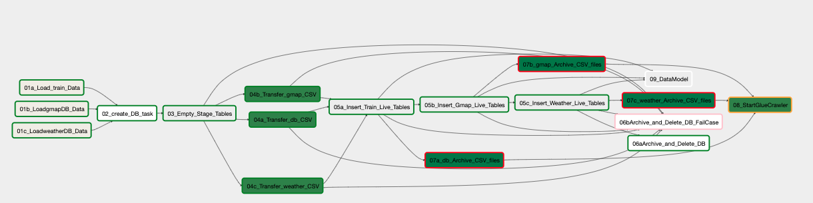
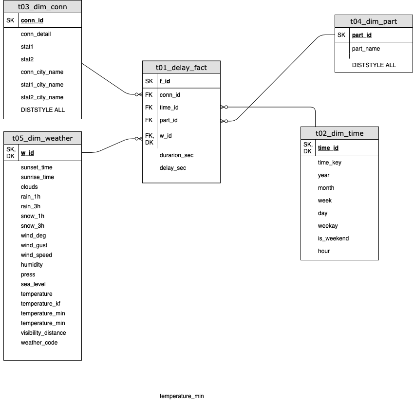

# Gathering and Analyzing Traffic and Delay Data for the Greater Munich Area

This project shows a way on how to gather structured and long-term traffic analytical information of the Greater Munich area. This contains data about many train and car connections and weather data.
This is also my Capstone project for my Udacity Nanodegree in Data Engineering and could get scaled out to potentially all other areas worldwide.

The main goal of this project is to:
- store data which is only live available in a structured way
- make the storing (ETL) process stable and transparent
- make analysis based on this data concerning:
    - Delays
    - Quicker means of transportation
    - Patterns in delays etc.., based on e.g.:
        - Weather
        - Time
        - etc.
    - etc.

This is done by the schiene python module (for more information on that, please see here: https://github.com/kennell/schiene/blob/master/README.md). \
Thanks for the great package to the developers.
Also the googlemaps and the pyowm modules are used for car traffic and weather data.
Please find details on that here:
https://github.com/googlemaps/
https://github.com/csparpa/pyowm
Also here: Thanks for the great and very helpful packages.

You'll need API keys for gathering data from these two APIs. On the specific websites the ways for getting the API keys are described.
**Please watch out: In some cases (depending on the volume of requests) these services can get very expensive!**

In all cases the data is stored as json files (one per request) in separate AWS S3 buckets.

Since all of the mentioned above packages work also in areas apart from the Greater Munich area, this process would also work in other parts of Germany or Europe.
If you choose other packages than Schiene, you could also expand the proces to all areas in the world.

# Process and data pipeline

The data pipeline consists of several steps. These are are shown in the chart below and described detailed after that.



## Data gathering
This process involves mainly web scrapping via the mentioned above APIs and storing each API request as a single json file in different S3 buckets (one for train, one for car and another one for weather data). This is carried out on an AWS EC2 and is scheduled via Apache Airflow. Also the start and stop of the EC2 could be scheduled on another (very low cost) EC2, which is always on (in case 24 hours request are not necessary.)
Please see the data gathering DAG below:



The overall dag runs approx. 40 minutes. I inserted all the waiting tasks for stretching out the web requests. Basically all the gatering work is done with BashOperators calling the relevant Python scripts (see below).
In the long run, one could think about making individual operators for these purposes.

In parallel also the Airflow DAG below runs every hour on minute 40. This dag is gathering the data again in reversed order. This way I can manage to gather more data in shorter time.



I chose S3 and the json format, since it is the most natural way to store this data (since the API request result in a single json file per record / request). In this way the raw data can be stored flexible and marked accordingly when loaded to the database. Therfore I have perfect control, what data was already loaded, what was not yet loaded and when what was loaded.
Also concerning costs it is - according to my current knowledge - the most sufficient way for this process.

### Quality check
As a second step the Airflow dag carries out a data quality check. As each task in the dag logs everything they do in a local log file (e.g. in case a single request causes an error and error gets logged, see files below for more details on that), after one dag run there are many log files on the local drive. It would be interesting to find very quick only the relvant error, i.e. to find out what request caused a "real" error and why.
Therefore the zz_errorlogging_task runs through all locally saved log files and searches for the word "error:". If it is found, these messages are gathered in a json file with the logfilename as key. After that all logfiles from a specific point of time are transferred to time-stamped folder in a S3 bucket an deleted from local drive. If this appears, an e-mail is send to notify me.

### Relevant files and scripts

All confidential data is stored in a local config file and loaded to the scripts via configparser.

#### sbahnmuc02.py
The relevant train stations are defind here and transfered to iterables and files.

#### sbahnmuc03.py
This script gathers data from the trains. The requests are parallalized with the multiprocessing module.

#### sbahnmuc04_gmap.py
This script gathers the date from Google map API. Due tothe fact this API gets very expensive the number of stations or start/destination combinations are reduced. The requests are parallalized with the multiprocessing module.

#### sbahnmuc05_weather.py
This script gathers the weather data. The requests are parallalized with the multiprocessing module.

#### airflow/dags/sbmd01_web_data_gathering.py, airflow/dags/sbmd01b_rev_web_data_gathering.py
The mentioned above dags.

#### zz_check_01_logs.py
See Quality checks part on that. This python script is carried out in the errorlogging task.

## Data transferring and DWH creation Step 1
This process is about aggregating and transforming the json data from the step before and transfer it into Amazon Redshift tables.

In a first step the database gets created from a snapshot. For the initial load the staging and live tables will be created. 
After that - using the first three scripts below - the data is transformed to a dataframa, bulk copied to a postgres staging table, inserted into the respective live tables and finally all transferred json files are archived into a newly created folder in the respective S3 bucket.

After this has finished, the database will be saved in a snapshot and deleted again, due to cost reasons. This snapshot will be used when creating the database for the next run.

This process is carried every two days and triggered via Apache Airflow on the same EC2 as for the data gathering process. Please see the DAG below:



This dag carries put the following steps:

- Using the first three (03b, 04b, 05b) scripts below - the data is transformed to a csv file and succesfully transferred json files are archived into a newly created folder in the respective S3 bucket (fthe folder name indicates the date of the archving process).
- Restoring a Amazon Redshift cluster from the latest snapshot.
- Truncating the staging tables.
- Transferring the csv files from task 1 to the Amazon Redshift staging tables.
- Inserting the staged data to live tables.
- Creating the data model.
- Deleting the Amazon redshift cluster with a new snapshot.
- Archiving the transferred csv files
- Run a glue crawler on the archived csv files.
- In case any database related step fails, the cluster gets deleted without a final snapshot. This way it gets assured, that no semi-finished data is loaded and unnecessary costs are avoided.

I chose Amazon Redshift here, since the data should be stored in a relational way, but also shoud be queried in a high-performant way. Also the connection to the S3 bucket is very good configured with this technology.
One advantage of an ordinary RDBMS would be the application of primary and foreign keys. Bit I've used other ways to ensure, that there are no duplicate records in the tables, by deleting staged data in live tables before inserting.
For cost saving reason the cluster is always deleted (with a snapshot) after the process.
For the possibility of continious analysing the data, the glue crawler is here. This way the csv data can always be analyzed with Amazon Athena.

### Data sources
All nested arrays in the json files below, will be spread across separate columns during the DB load process in the "b" scripts below.

#### Deutsche Bahn API
This is live data about all Deutsche Bahn trains. For details on the API, please see the mentioned above schiene module documentation.
There are basically two kinds of requests:

##### Station names
This is done in the mentioned below 02 script. Since the API only operates on station names stored in strings, I have to gather the exact naming for the desired stations. Therefore a list with city and or street names is provided for this API to gather the DB API names.

The result contains the DB API names in two-fold combinations as a list and is stored in a pickled object, so it could be used in the next step for gathering connection details between all these stations.

##### Connection details
This is done in the mentioned below 03 script and is gathering now all avaiable connection data for the station pairs created on the previous step.
See an example of a connection json result below:
```
{"details": "http://mobile.bahn.de/bin/mobil/query.exe/dox?ld=36221&n=1&i=7p.024257221.1580674711&rt=1&use_realtime_filter=1&co=C0-2&vca&HWAI=CONNECTION$C0-2!details=opened!detailsVerbund=opened!&", "departure": "00:18", "arrival": "07:10", "transfers": 3, "time": "6:52", "products": ["M", "ICE", "U"], "price": 45.9, "ontime": true, "delay": {"delay_departure": 0, "delay_arrival": 0}, "canceled": false, "date": "2020-02-02", "_id": "2020-02-02_00:18_Bad Aibling_N\u00fcrnberg-Herrnh\u00fctte", "timestamp": "2020-02-02 20:18:34.018139", "total_delay": 0, "start": "Bad Aibling", "end": "N\u00fcrnberg-Herrnh\u00fctte"}
```
The gathered json data is stored in a specific S3 bucket for the train data. The "_id" field makes sure, that only the latest information for a connection gets stored.

###### Fields
- details: Detailed URL of query
- departure: Scheduled departure of connection
- arrival: Scheduled arrival of connection
- transfers: Number of different transfers for the specific connection
- time: Taken time for connection
- products: what kind of transportation methods to use for the connection
- price: Price for connection in EUR
- ontime: Indicator, whether the connection is on-time
- delay_departure: delay in minutes at departure
- delay_arrival: delay in minutes at arrival
- canceled: Indicator, whether the connection is canceled
- date: date of the connection
- _id: an id for the specific connection created while requesting
- timestamp: timestamp of request
- start: Start Station
- end: Destination station

#### Google maps API
This is the Google maps API, please see link above for details. In this section (with the use of the 04 script below) car connections are requested in the same manner as for the train connections above.
One little difference: Due to the pricing policy of the google maps api, the amount of start and end locations has been reeduced to only city names (no specific streets or similar).
See an example of the json file below:
```
{"distance": {"text": "17.7 km", "value": 17666}, "duration": {"text": "31 mins", "value": 1834}, "duration_in_traffic": {"text": "27 mins", "value": 1602}, "end_address": "M\u00fcnchen Ost, 81667 M\u00fcnchen, Germany", "end_location": {"lat": 48.1268711, "lng": 11.606603}, "start_address": "M\u00fcnchen-Pasing, Pasinger Bahnhofspl. 9, 81241 M\u00fcnchen, Germany", "start_location": {"lat": 48.1494501, "lng": 11.4612741}, "traffic_speed_entry": [], "via_waypoint": [], "stat1": "M\u00fcnchen-Pasing", "stat2": "M\u00fcnchen-Ost"}
```

##### Fields
- distance: Details about the distance in km
- duration: Details about the distance in mins / seconds in normal traffic
- duration_in_traffic: Details about the distance in mins / seconds considering traffic situation
- end_address, end_location, start_address, start_location: details about start and end locations
- stat1: Entered start location
- stat2: Eneterd end location

#### Weather data
The weather data is gathered per hour for each locattion, which is relevant for the other two data gathering processes above. It is carried out with the pyowm module and the 05 scripts below. Please see the link above for more details on that. See an example json below:

```
{"reception_time": 1580671512, "Location": {"name": "Altomunster", "coordinates": {"lon": 11.26, "lat": 48.39}, "ID": 2956951, "country": "DE"}, "Weather": {"reference_time": 1580671512, "sunset_time": 1580660021, "sunrise_time": 1580625804, "clouds": 40, "rain": {}, "snow": {}, "wind": {"speed": 5.7, "deg": 230}, "humidity": 93, "pressure": {"press": 1013, "sea_level": null}, "temperature": {"temp": 284.54, "temp_kf": null, "temp_max": 285.37, "temp_min": 283.71}, "status": "Clouds", "detailed_status": "scattered clouds", "weather_code": 802, "weather_icon_name": "03n", "visibility_distance": 10000, "dewpoint": null, "humidex": null, "heat_index": null}}
```

##### Fields
- reception_time: timestamp of request
- Location: details about the location
- Weather: This nested array, contains all kind of weather information.

### Relevant files and scripts
All confidential data is stored in a local config file and loaded to the scripts via configparser.

The three files below transfer the transformed json data to a csv file in a separate folder in the respective AWS S3 bucket, respectively for train, car and weather data. Once a record was succesfully integrated in the respectice csv file, the json file will be moved to a archive folder in the respective folder, marked by the archiving date. This way I have perfect control waht was succesfully loaded.

#### sbahnmuc03b_TransferDB.py
#### sbahnmuc04b_TransferDB.py
#### sbahnmuc05b_TransferDB.py

#### DeArchive.py
Python script for undoing a specific loading process in the respective S3 bucket for one of the three scripts mentioned before. This scripts are also carried out parameterized in case one of the three scripts above fail. This is done for making sure, that I have perfect control over what was succesfully loaded.

#### CreateTables.py, create_tables_run.py
Python script for creatin live and staging tables during initial database creation.

#### zzCreateRedC.py
Creates a Amazon Redshift database from a snapshot. During the script the latest snapshot gets defined.

#### zzDelRedC.py
Deletes the database and creates a final snapshot with a specified name, so that during creation process the latest snapshot can be found and re-created.

#### airflow helpers

##### InsertTables.py
This script contains the necessary SQL scripts for transferring data between the Amazon Redshift stagig and live tables.

#### airflow operators

##### archivecsv.py
This operator archives the succesfully loaded csv files.

##### modifyred.py
This operator modifies a defined Amazon Redshift cluster (either restores it from a snapshot or deletes it with or without a final snapshot).

##### runglue.py
This operator starts a defined glue crawler.

##### s3csvredshift.py
This operator transfers defined csv files from an AWS S3 bucket to a defined Amazon Redshift cluster.

## Data Modelling 

## Tables in Amazon Redshift
Basically for all three data sources there is always one staging and one live table. The table names indicate what data source is covered by it. The staging tables contain the pure json/csv data without any formatting indexing etc for one loading process. 
The live tables contain all the staged data cumulated, but these already have proper data types and primary keys. These tables are the basis for the modelling process and contain the same fields and information as the json files.
Please see the create_table scripts for details on the tables.

The main DWH model aims at answering all sort of questions on the traffic a´ll around the Gretáter Munich area, e.g. when are faster by train? What weather conditions benefits the car? etc.
Therefore a star-schema based data model is created:



- Fact Table:
    - Duration of travel time in seconds (duration_sec)
    - Delay in seconds
    - Keys:
        - Transport Mean (part_id)
        - Datetime (hour based) of trip (time_id)
        - Connection Detail (Start and End of a trip on a detail, i.e. street or station, level, conn_id)
        - Weather_id

- Time Dimension
    - Key:
        - Datetime(hour based) of trip
        - Year
        - Month
        - Day
        - Weekday
        - Is weekend?
        - Hour

- Transport Mean Dimension
    - Key:
        - Transport Mean (Car or train)

- Connection Dimension
    - Key:
        - Connection Detail
    - Start Detail Level
    - Start city
    - End detail level
    - End city

- Weather Dimension
    - Key:
        - Start location of connection Detail   
        - Datetime (hour based)
    - diverse standard weather attributes

## Other Files

All confidential AWS data is stored in a local config file and loaded to the scripts via configparser.

### zz01_startVM1.py, zz02_StopVM1.py, zz01b_bash.sh, zz02b_bash.sh
This scripts start or stop the productive VM

### zz04_rm_json.sh
Script used for deleting old json files, which are temporarily stored on disc of the EC2 during the data gathering process.

### systemd folder
Systemd files for auto-start of Airflow services.


