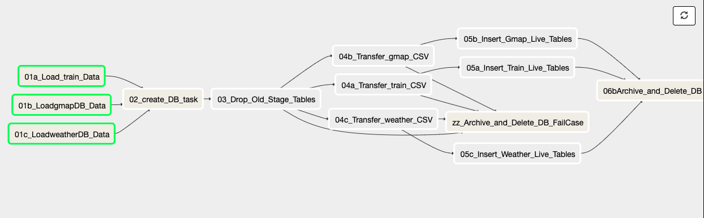

# Gathering and Analyzing Traffic and Delay Data for the Greater Munich Area

This git repo shows a way on how to gather structured and long-term traffic analytical information of the Greater Munich area. This contains data about many train and car connections and weather data.
This is also my Capstone project for my Udacity Nanodegree in Data Engineering.

This is mainly done by the schiene python module (for more information on that, please see here: https://github.com/kennell/schiene/blob/master/README.md). \
Thanks for the great package to the developers.

Also the googlemaps and the pyowm is used for traffic and weather data.
Please find details on that here:
https://github.com/googlemaps/
https://github.com/csparpa/pyowm
Also here: Thanks for the great and very helpful packages.

You'll need API keys for gathering data from these two APIs. On the specific websites the ways for getting the API keys are described.
**Please watch out: In some cases (depending on the volume of requests) these services can get very expensive!**

In all cases the data is stored as json files in separate AWS S3 buckets.

Since all of the mentioned above packages work also in areas apart from the Greater Munich area, this process would also work in other parts of Germany or Europe.
If you choose other packages than Schiene, you could also expand the proces to all areas in the world.

# Process and data pipeline

The data pipeline consists of three steps

## Data gathering
This process involves mainly web scrapping via the mentioned above APIs and storing each API request as a json files in different S3 buckets (one for train, one for car and another one for weather data). This is carried out on an AWS EC2 and is scheduled via Apache Airflow. Also the start and stop of the EC2 is scheduled on another (very low cost) EC2, which is always on.
Please see the gathering DAG below:


The overall dag runs max. 1 hour. I inserted all the waiting tasks for stretching out the web requests. Basically all the gatering work is done with BashOperators calling the relevant Python scripts (see below).
In the long run, one could think about making individual operators for these purposes.

I chose S3 and the json format, since it is the most natural way to store this data (since the API request result in single a single json file per record). In this way the raw data can be stored flexible and marked accordingly when loaded to the database. Therfore I have perfect control, what data was already loaded, what was not yet loaded and when what was loaded.
Also concerning costs it is - according to my current knowledge - the most sufficient way for this process.

### Relevant files

All confidential data is stored in a local config file and loaded to the cripts via configparser.

#### sbahnmuc02.py
The relevant train stations are defind here and transfered to iterables and files.

#### sbahnmuc03.py
This script gathers data from the trains.

#### sbahnmuc04_gmap.py
This script gathers the date from Google map API. Due tothe fact this API gets very expensive the number of stations or start/destination combinations are reduced.

#### sbahnmuc05_weather.py
This script gathers the weather data.


## Data transferring
This process is about aggregating and transforming the json data from the step before and transfer it into Postgres tables (running on a AWS RDS service).

In a first step the database gets created from a snapshot. For the initial load the live tables will be created. 
After that - using the first three scripts below - the data is transformed to a dataframa, bulk copied to a postgres staging table, inserted into the respective live tables and finally all transferred json files are archived into a newly created folder in the respective S3 bucket.

After this has finished, the database will be saved in a snapshot and deleted again, due to cost reasons. This snapshot will be used when creating the database for the next run.

This process is carried out once a week and triggered via Apache Airflow on the same EC2 as for the data gathering process. Please see the DAG below:



Also this dag consists only of BashOperators calling the relevant Python scripts (see below). In the long run, one could think about making individual operators for these purposes.

I chose postgres here, since the data should be stored in a relational way. Since the data is currently not that big and proper indexed AWS Redshift or another MPP database is not necessary.
Of course,m when the datra should be scaled - e.g. to all areas in Germany - postgres would not be sufficient anymore. Than maybe Appache Cassandra or a direct transfer to AWS redshift should be preferred.

### Data sources
All nested arrays in the json files below, will be spread across separate columns during the DB load process in the "b" scripts below.

#### Deutsche Bahn API
This is live data about all Deutsche Bahn trains. For details on the API, please see the mentioned above schiene module documentation.
There are basically two kinds of requests:

##### Station names
This is done in the mentioned below 02 script. Since the API only operates on station names stored in strings, I have to gather the exact naming for the desired stations. Therefore a list with city and or street names is provided for this API to gather the DB API names.

The result contains the DB API names in two-fold combinations as a list and is stored in a pickled object, so it could be used in the next step for gathering connection details between all these stations.

##### Connection details
This is done in the mentioned below 03 script and is gathering now all avaiable connection data for the station pairs created on the previous step.
See an example of a connection json result below:
```
{"details": "http://mobile.bahn.de/bin/mobil/query.exe/dox?ld=36221&n=1&i=7p.024257221.1580674711&rt=1&use_realtime_filter=1&co=C0-2&vca&HWAI=CONNECTION$C0-2!details=opened!detailsVerbund=opened!&", "departure": "00:18", "arrival": "07:10", "transfers": 3, "time": "6:52", "products": ["M", "ICE", "U"], "price": 45.9, "ontime": true, "delay": {"delay_departure": 0, "delay_arrival": 0}, "canceled": false, "date": "2020-02-02", "_id": "2020-02-02_00:18_Bad Aibling_N\u00fcrnberg-Herrnh\u00fctte", "timestamp": "2020-02-02 20:18:34.018139", "total_delay": 0, "start": "Bad Aibling", "end": "N\u00fcrnberg-Herrnh\u00fctte"}
```
The gathered json data is stored in a specific S3 bucket for the train data. The "_id" field makes sure, that only the latest information for a connection gets stored.

###### Fields
- details: Detailed URL of query
- departure: Scheduled departure of connection
- arrival: Scheduled arrival of connection
- transfers: Number of different transfers for the specific connection
- time: Taken time for connection
- products: what kind of transportation methods to use for the connection
- price: Price for connection in EUR
- ontime: Indicator, whether the connection is on-time
- delay_departure: delay in minutes at departure
- delay_arrival: delay in minutes at arrival
- canceled: Indicator, whether the connection is canceled
- date: date of the connection
- _id: an id for the specific connection created while requesting
- timestamp: timestamp of request
- start: Start Station
- end: Destination station

#### Google maps API
This is the Google maps API, please see link above for details. In this section (with the use of the 04 script below) car connections are requested in the same manner as for the train connections above.
One little difference: Due to the pricing policy of the google maps api, the amount of start and end locations has been reeduced to only city names (no specific streets or similar).
See an example of the json file below:
```
{"distance": {"text": "17.7 km", "value": 17666}, "duration": {"text": "31 mins", "value": 1834}, "duration_in_traffic": {"text": "27 mins", "value": 1602}, "end_address": "M\u00fcnchen Ost, 81667 M\u00fcnchen, Germany", "end_location": {"lat": 48.1268711, "lng": 11.606603}, "start_address": "M\u00fcnchen-Pasing, Pasinger Bahnhofspl. 9, 81241 M\u00fcnchen, Germany", "start_location": {"lat": 48.1494501, "lng": 11.4612741}, "traffic_speed_entry": [], "via_waypoint": [], "stat1": "M\u00fcnchen-Pasing", "stat2": "M\u00fcnchen-Ost"}
```

##### Fields
- distance: Details about the distance in km
- duration: Details about the distance in mins / seconds in normal traffic
- duration_in_traffic: Details about the distance in mins / seconds considering traffic situation
- end_address, end_location, start_address, start_location: details about start and end locations
- stat1: Entered start location
- stat2: Eneterd end location

#### Weather data
The weather data is gathered per hour for each locattion, which is relevant for the other two data gathering processes above. It is carried out with the pyowm module and the 05 scripts below. Please see the link above for more details on that. See an example json below:

```
{"reception_time": 1580671512, "Location": {"name": "Altomunster", "coordinates": {"lon": 11.26, "lat": 48.39}, "ID": 2956951, "country": "DE"}, "Weather": {"reference_time": 1580671512, "sunset_time": 1580660021, "sunrise_time": 1580625804, "clouds": 40, "rain": {}, "snow": {}, "wind": {"speed": 5.7, "deg": 230}, "humidity": 93, "pressure": {"press": 1013, "sea_level": null}, "temperature": {"temp": 284.54, "temp_kf": null, "temp_max": 285.37, "temp_min": 283.71}, "status": "Clouds", "detailed_status": "scattered clouds", "weather_code": 802, "weather_icon_name": "03n", "visibility_distance": 10000, "dewpoint": null, "humidex": null, "heat_index": null}}
```

##### Fields
- reception_time: timestamp of request
- Location: details about the location
- Weather: This nested array, contains all kind of weather information.

### Relevant files
All confidential data is stored in a local config file and loaded to the scripts via configparser.

The three files below transfer the transformed json data to postgres staging tables, respectively for train, car and weather data.

#### sbahnmuc03b_TransferDB.py
#### sbahnmuc04b_TransferDB.py
#### sbahnmuc05b_TransferDB.py
#### zz07_Transfer_DB_Data.sh
This summarizes the three scripts abover in a shell script.

#### airflow folder
This folder contains all necessary files for the Airflow dag.

#### CreateTables.py, zz08_CreateEmptyDBTables.py
Python script for creatin live and staging tables during initial database creation.

#### DeArchive.py
Python script for undoing a specific loading process in the respective S3 bucket.

#### InsertTables.py, zz09_InsertLiveTables.py
Loads data from the staging tables into the live tables. In a first step here, the keys, which are stored in the staging tables are deleted from the live tables (just in case to avoid errors). After that the inserts are carried out.

#### zzCreateDB.py
Creates a AWS RDS postgres database from a snapshot. During the script the latest snapshot gets defined.

#### zzDelDB.py
Deletes the database after loading process has finished and creates a final snapshot with a specified name, so that during creation process the latest snapshot can be found and re-created.


## Data Modelling 

## Tables in Postgres Database


## Other Files

All confidential AWS data is stored in a local config file and loaded to the cripts via configparser.

### zz01_startVM1.py, zz02_StopVM1.py, zz01b_bash.sh, zz02b_bash.sh
This scripts start or stop the productive VM

### zz04_rm_json.sh
Script used for deleting old json files, which are temporarily stored on disc of the EC2 during the data gathering process.


